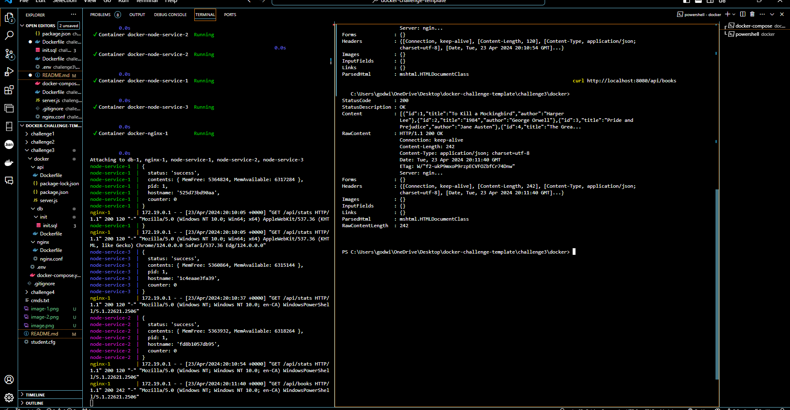

# Proof of Work and Full Report Below (CHALLENGE 1 & 2 ) 
- You can find the proof of work and the full report in the following link:

[Proof of Work and Full Report] (https://mysait-my.sharepoint.com/:w:/g/personal/godwinjb_mercado_edu_sait_ca/Eb-f3Bp5aN5Gg9ovQeHAK_QBUvkaf5lZBxJoO0IExp_IsQ?e=N2iEUl)

This repository has been created by Godwin Mercado, but the ownership of this content is retained by SAIT under Educational and Fair Use.

# CHALLENGE 3 & 4  - Fullstack and Scaling

This challenge revolved on hosting full-stack applications with a database host. 
### Configurations
<li>  Reconfigured the Docker File in /api of lines 7 and 14, so we can copy the packages and application in the correct directory.</li>
<li> Reconfigured Server.js so we can have the server appropriately connect with the.env variables </li>
<li> Docker-compose.yml: This required the most attention, as such we had to set the services that would be used: nginx, node-services, and db.
<li> Reconfigured the Nginx.conf. </li> This has to do with the scalability and address the proxy server and the node-service package being fairly new so upstream is deprecated and needs to be handled appropriately. We also need to setup the backend. 

### File Changes and Repo Setup
1.  Click on this link to open the Github Repository that contains the Docker challenge template
2. Click on the fork button to create a fork(Copy) of the repository. Once redirected, just note in order to be up-to-date with an existing fork, ensure you sync your already existing fork.
3. **Set up your .ENV**  With the following Variables: 

[NOTE] - these .env variable values and assignments are arbitrary for the sake of this challenge so you can change the username and password to whatever you'd like to desire.

```
DB_ROOT_PASSWORD=<password>
DB_DATABASE=<database>
DB_USERNAME=<username>
DB_HOST=<host>
MYSQL_ROOT_PASSWORD=<password>
MYSQL_DATABASE=<database>
MYSQL_USER=<user>
MYSQL_PASSWORD=<password>
MYSQL_HOST=<host>
```
 #### DOCKER-COMPOSE.YML 
4. Create a ``docker-compose.yml`` file, in here you're going to define the services, the ports,  and the dependencies. This is what creates your container and the context related to the services. For the sake of this challenge and onwards, we will be using db folder as the database, the api folder for your node-services and api requests, and NGINX which is going to be your port and proxy servers. In our case: We will map the proxy server to make requests in 8080:80, our db is going to be hosted on ports: 3306, ideally, and if you find yourself having an error with it being in used you can either do the command: ```netstat -na | find "8080"``` otherwise for the sake of convenience, we can just open the next available port and assign it in order of ```3307:3306``` Accordingly to docker-compose.yml file in this repo. ***CHALLENGE 4 To address the scalability and having different hostnames we can address this by having our node-service deploy 3 different replicas, such that we are simulating 3 different devices/users in varying locations to interact with the localhost:8080/api/stats endpoint.***

[NOTE] Server JS, ensure your MYSQL database has a connection by creating a pool and ensuring that the credentials to the database is assigned in the server.js 
  
### NGINX.CONF
5. Edit the NGNIX.conf Due to varying versions of node-services we might have to change the nginx.conf. As such for ***CHALLENGE 4*** We will create an ``events { worker_connections 1024} this value of 1204 is arbitrary. When you use the replicas option in Docker Swarm or Kubernetes to scale your services, you are creating multiple instances of your application, each running in its own container. However, the worker_connections directive in Nginx is primarily concerned with connections managed by the Nginx server, not the application instances themselves. Resolver directive sets the IP Address to the internal Docker DNS this is to resolve any domain issues and we make it valid so it's considered valid in a 10 second duration so upon start it's not causing any issues and being labelled as invalid. 
The server directive is used to specify the server name aka localhost, we also want the upstream to be listening on port '8080' while our server listens on 80. 
We then specify the location of the roots, index, and the location api so we state that the nginx should handle requests to the /api endpoint, and using the set directive we name a variable backend, appropriately to loadbalancer like what we were given. 
Proxy_pass is to allow any requests to the backend specified by the backend variable and it forwards to the upstream group loadbalancer. 

### Docker Commands
remember to do: 
```cd challenge3\docker``` as this is the root

For the Docker Containment and building once everything is setup and the files have been setup. We have to deploy and initialize the our containers using the
```docker-compose up```
If it says it cannot find the path or file 

This indicates it is running from here you can execute the following commands: 
```docker-compose ps```
This should be the result:


if you execute ```curl http://localhost:8080/api/stats``` 3 times you should getting various results 


if you execute ```curl http://localhost:8080/books```
 


